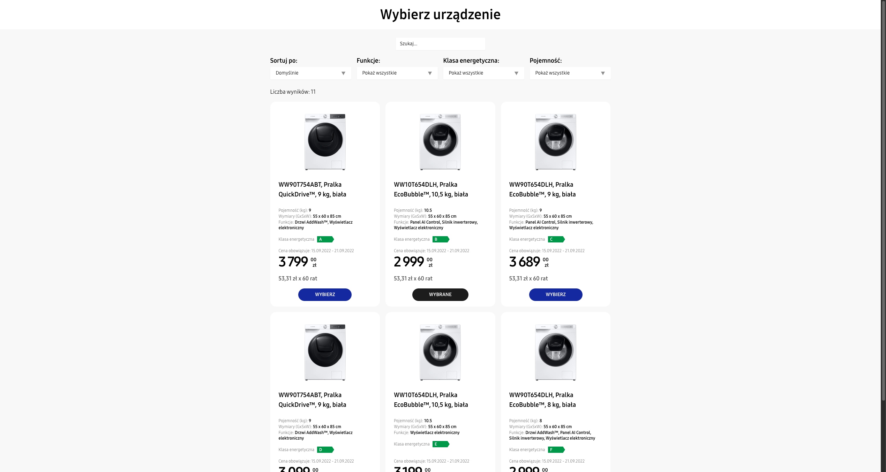
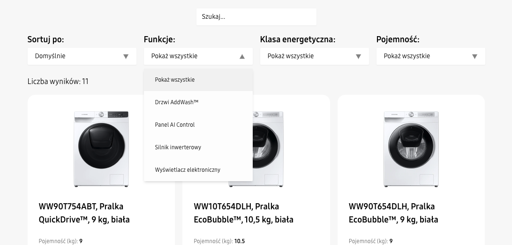
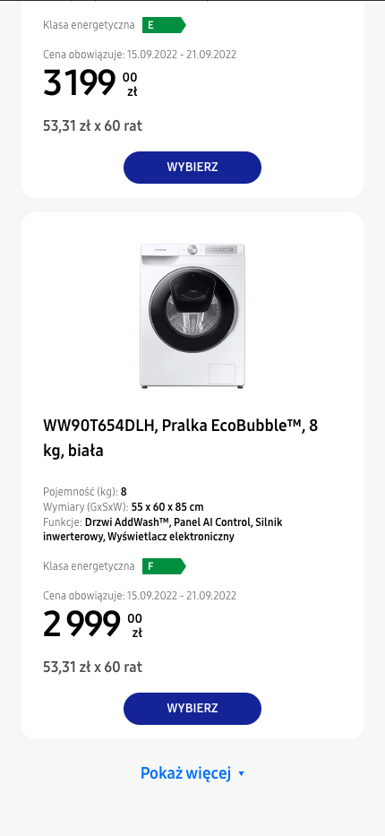

# Cheil - Recruitment Assignment



A React application featuring a product listing page for a product configurator, built with modern web technologies and best practices.

## 💻 Features

- **Product Filtering & Sorting**

  - Search products by name
  - Sort by price, capacity, and popularity
  - Filter by features, energy class, and capacity
  - Debounced search for better performance

- **Responsive Design**

  - Mobile-first approach
  - Grid layout adapting to different screen sizes
  - Tailwind CSS for styling

- **Accessibility**

  - ARIA labels and roles
  - Keyboard navigation support
  - Screen reader friendly
  - Semantic HTML structure

- **User Experience**
  - Loading skeletons
  - Load more products functionality

## 🛠 Tech Stack

- React
- TypeScript
- Redux Toolkit
- TailwindCSS
- Vite

## 🖼️ Screenshots
**Filters:**


**Mobile filters:**


**Mobile listing:**



## 🏗 Project Structure

```
src/
├── components/ # UI components
├── features/ # Redux slices and selectors
├── hooks/ # Custom React hooks
├── shared/ # Shared types and constants
└── store.ts # Redux store configuration
```

## 🔧 Setup & Installation

1. Clone the repository
2. Install dependencies:

```bash
npm install
```

3. Run development server:

```bash
npm run dev
```

## 🧪 Key Technical Decisions

1. **State Management**

   - Redux Toolkit for global state management
   - Custom selectors for efficient filtering and sorting

2. **Performance Optimizations**

   - Debounced search input
   - Lazy loading images
   - Incremental product loading

3. **Type Safety**
   - Strict TypeScript configuration
   - Comprehensive type definitions for all components

## 🎨 Styling Approach

- Tailwind CSS for utility-first styling
- Custom color palette matching provided design in Figma

## 📱 Responsive Design

- Mobile: Single column layout
- Tablet: Two columns grid
- Desktop: Three columns grid

## 🌟 Additional Features

- Custom select component with keyboard navigation

## 🔍 Future Improvements

1. Image optimization
2. General performance optimizations
